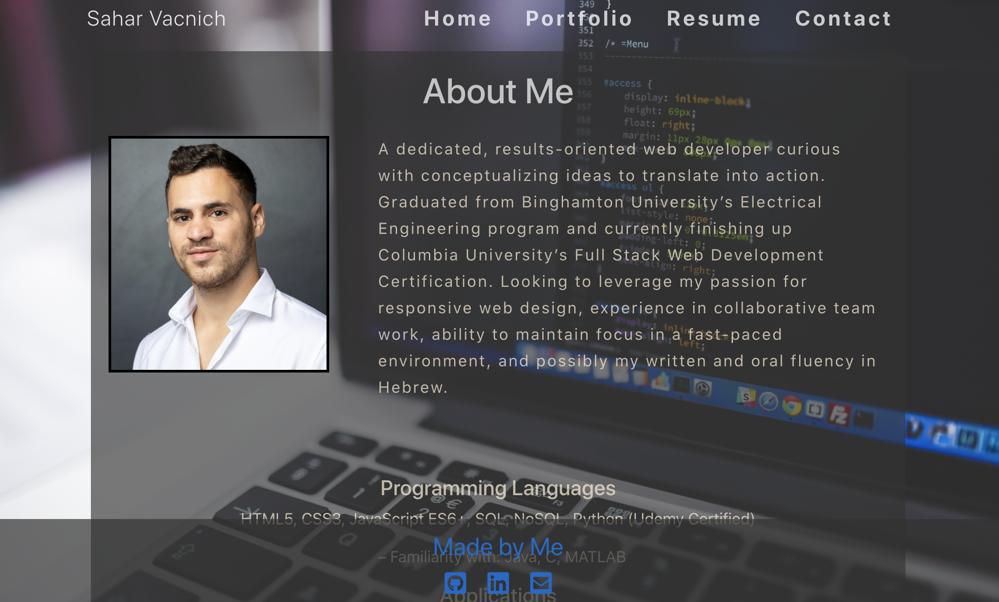

# Portfolio

  

  ## Description
  A React portfolio app displaying my work and professional life

  ## Languages
  JavaScript, HTML, CSS

  ## Deployed Link
  https://saharvac.github.io/portfolio/

  ## Table of Contents
  - [Credits](#Credits)
  - [Usage](#Usage)
  - [Questions](#Questions)
  - [License](#License)

  ## Credits
  Sahar Vacnich

  ## Usage
  Site is easily navigable

  ## Questions
  [link to my GitHub!](https://github.com/saharVac)
  
  [Email me!](mailto:vcsahar@gmail.com)
